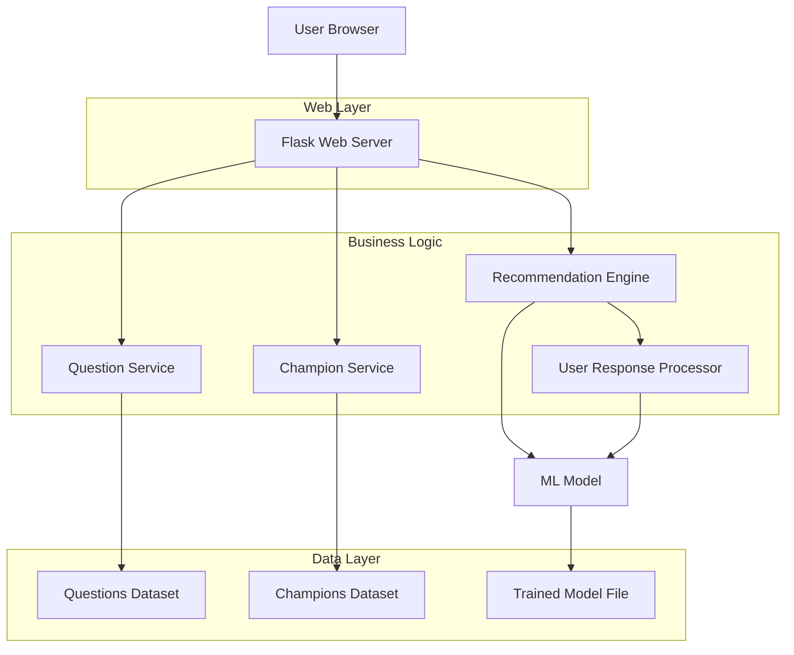

# Design Document

## Overview

The League of Legends Champion Recommendation System is a Python web application that uses machine learning to suggest champions based on user preferences. The system consists of a web frontend for user interaction, a Python backend with ML capabilities, and data management for champions and questions.

The application follows a modular architecture with clear separation between the web interface, business logic, and machine learning components. It will use Flask as the web framework for its simplicity and flexibility, combined with scikit-learn for machine learning capabilities.

## Architecture



## Components and Interfaces

### Web Layer

**Flask Application (`app.py`)**
- Main application entry point
- Route definitions for web endpoints
- Template rendering and static file serving
- Session management for user responses

**Templates**
- `index.html`: Landing page with start button
- `question.html`: Individual question display
- `recommendation.html`: Results page with champion details
- `base.html`: Common layout template

**Static Assets**
- CSS for responsive styling
- JavaScript for interactive elements
- Champion images and icons

### Business Logic Layer

**Question Service (`services/question_service.py`)**
```python
class QuestionService:
    def get_all_questions() -> List[Question]
    def get_question_by_id(question_id: int) -> Question
    def validate_answer(question_id: int, answer: Any) -> bool
```

**Champion Service (`services/champion_service.py`)**
```python
class ChampionService:
    def get_champion_by_name(name: str) -> Champion
    def get_all_champions() -> List[Champion]
    def get_champion_details(champion_id: str) -> ChampionDetails
```

**Recommendation Engine (`services/recommendation_engine.py`)**
```python
class RecommendationEngine:
    def __init__(self, model_path: str)
    def predict_champion(user_responses: Dict) -> ChampionRecommendation
    def get_alternative_recommendations(user_responses: Dict, exclude: List[str]) -> List[ChampionRecommendation]
    def explain_recommendation(champion: str, user_responses: Dict) -> str
```

### Data Models

**Question Model (`models/question.py`)**
```python
@dataclass
class Question:
    id: int
    text: str
    question_type: str  # multiple_choice, scale, boolean
    options: List[str]  # for multiple choice
    weight: float  # importance in ML model
```

**Champion Model (`models/champion.py`)**
```python
@dataclass
class Champion:
    id: str
    name: str
    title: str
    role: str
    difficulty: int
    tags: List[str]
    image_url: str
    abilities: List[Ability]
    
@dataclass
class ChampionRecommendation:
    champion: Champion
    confidence_score: float
    explanation: str
    match_reasons: List[str]
```

**User Response Model (`models/user_response.py`)**
```python
@dataclass
class UserResponse:
    question_id: int
    answer: Any
    timestamp: datetime
    
@dataclass
class UserSession:
    session_id: str
    responses: List[UserResponse]
    current_question: int
    completed: bool
```

### Machine Learning Component

**Model Training (`ml/model_trainer.py`)**
- Feature engineering from champion characteristics
- Training pipeline using scikit-learn
- Model evaluation and validation
- Model persistence and loading

**Feature Engineering (`ml/feature_processor.py`)**
```python
class FeatureProcessor:
    def process_user_responses(responses: List[UserResponse]) -> np.ndarray
    def encode_champion_features(champion: Champion) -> np.ndarray
    def create_training_data() -> Tuple[np.ndarray, np.ndarray]
```

## Data Models

### Champion Dataset Structure
```json
{
  "champions": [
    {
      "id": "aatrox",
      "name": "Aatrox",
      "title": "The Darkin Blade",
      "role": "Fighter",
      "difficulty": 4,
      "tags": ["Fighter", "Tank"],
      "attributes": {
        "attack": 8,
        "defense": 4,
        "magic": 3,
        "difficulty": 4
      },
      "abilities": [...]
    }
  ]
}
```

### Questions Dataset Structure
```json
{
  "questions": [
    {
      "id": 1,
      "text": "What role do you prefer to play?",
      "type": "multiple_choice",
      "options": ["Top", "Jungle", "Mid", "ADC", "Support"],
      "weight": 0.9,
      "feature_mapping": "preferred_role"
    }
  ]
}
```

## Error Handling

### Input Validation
- Validate all user inputs on both client and server side
- Sanitize data before processing
- Handle malformed or missing responses gracefully

### ML Model Error Handling
```python
try:
    recommendation = model.predict(features)
except ModelNotLoadedException:
    return fallback_recommendation()
except InvalidInputException as e:
    log_error(e)
    return error_response("Invalid input provided")
```

### Web Application Error Handling
- Custom error pages for 404, 500 errors
- Graceful degradation when ML model is unavailable
- Session timeout handling
- Database connection error recovery

## Testing Strategy

### Unit Tests
- Test individual service methods
- Mock external dependencies
- Test data model validation
- ML model prediction accuracy tests

### Integration Tests
- End-to-end user flow testing
- API endpoint testing
- Database integration tests
- ML pipeline integration tests

### Frontend Tests
- UI component testing
- User interaction testing
- Responsive design testing
- Cross-browser compatibility

### Performance Tests
- Load testing for concurrent users
- ML model prediction latency
- Database query performance
- Static asset loading optimization

## Security Considerations

- Input sanitization to prevent XSS attacks
- CSRF protection for form submissions
- Rate limiting for API endpoints
- Secure session management
- Data validation at all entry points

## Deployment Architecture

### Development Environment
- Local Flask development server
- SQLite for development database
- Local file storage for datasets

### Production Environment
- WSGI server (Gunicorn) with Flask
- PostgreSQL or MySQL for production data
- Redis for session storage and caching
- Static file serving via CDN or nginx
- ML model served via pickle files or MLflow