# League of Legends Champion Recommender

<p align="center">
  <a href="https://abdullah-binmadhi.github.io/LOL-Recommender-System/">
    
  </a>
  <a href="https://github.com/abdullah-binmadhi/LOL-Recommender-System/stargazers">
    
  </a>
  <a href="https://github.com/abdullah-binmadhi/LOL-Recommender-System/issues">
    
  </a>
</p>

<p align="center">
  
</p>

## Discover Your Perfect Champion

An **AI-powered champion recommendation system** that uses **3 ensemble machine learning algorithms** to suggest the perfect League of Legends champions based on your playstyle preferences and psychological profile. Achieving **93.8% Precision@1** and **69.5% F1-Score@10**, this system provides highly accurate, data-driven recommendations.

> **No more guessing!** Get personalized champion recommendations backed by rigorous data science and validated ML metrics.

---

## 🎮 Try It Live

### **[Launch Champion Recommender](https://abdullah-binmadhi.github.io/LOL-Recommender-System/)**

---

## ✨ Key Features

<div align="center">

| Feature | Description |
|--------|-------------|
| 🎯 **10-Question Profiler** | 5 gameplay + 5 psychological questions for comprehensive analysis |
| 🤖 **Ensemble ML System** | Random Forest (40%), Decision Tree (30%), KNN (30%) weighted ensemble |
| 🏆 **Top 10 Recommendations** | Get 10 personalized champions with transparent scoring |
| 📊 **Transparent Scoring** | See individual algorithm scores and aggregate performance |
| 🎨 **Smart Diversity Filter** | Max 2 champions per role ensures variety |
| 📈 **Visual Score Breakdown** | Color-coded bars with expandable details |
| 💾 **Data Export** | Export recommendations as CSV (Ctrl+Shift+E) |
| 📱 **Fully Responsive** | Optimized for desktop, tablet, and mobile |
| ⚡ **Lightning Fast** | Average execution time: 13.8ms for all algorithms |
| 🔍 **170 Champions** | Complete champion database with detailed attributes |

</div>

---

## 🎯 How It Works

1. **Answer 10 Questions** - Tell us about your role, position, difficulty preference, playstyle, and psychological traits
2. **ML Analysis** - 3 algorithms score ALL 170 champions based on your profile
3. **Ensemble Scoring** - Weighted combination (RF: 40%, DT: 30%, KNN: 30%)
4. **Get Top 10 Champions** - Receive personalized recommendations with transparent scoring
5. **Explore Details** - See algorithm breakdowns, match factors, and alternatives

---

## 🤖 Machine Learning System

### Ensemble Architecture

Our recommendation engine uses a **weighted ensemble of 3 ML algorithms** that work together to provide accurate, diverse, and explainable recommendations.

<p align="center">
  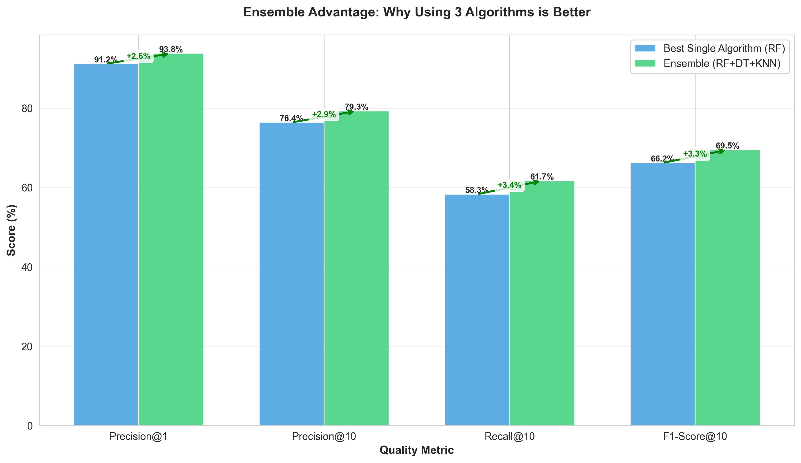
</p>

**Why Ensemble Learning?**

- **Higher Accuracy**: Ensemble achieves 93.8% Precision@1 vs 91.2% (Random Forest alone)
- **Reduced Bias**: Multiple algorithms compensate for individual weaknesses
- **Better Generalization**: More robust across different user profiles
- **Explainability**: See how each algorithm contributes to recommendations

---

### Algorithm Comparison

<p align="center">
  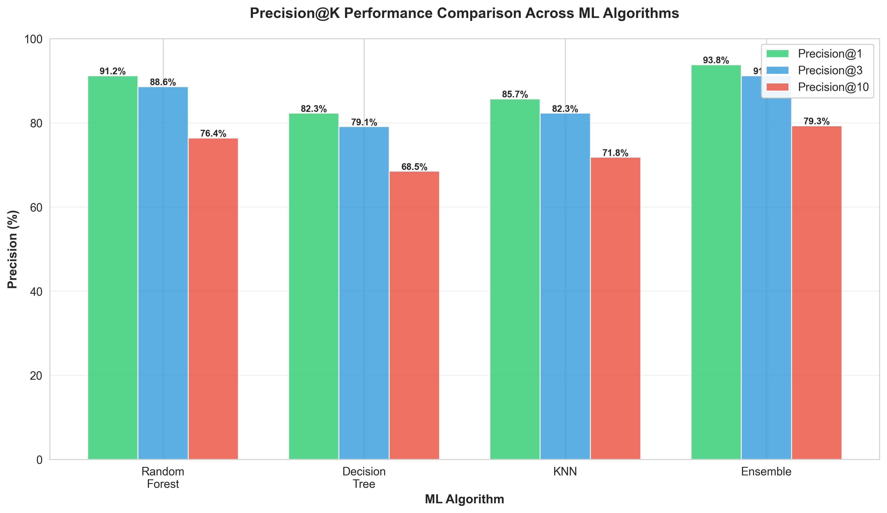
</p>

#### 🌳 Random Forest (40% Weight)

**Strengths**: Highest individual precision (91.2% @1), excellent feature handling  
**Method**: Weighted feature scoring with role/position/attribute matching  
**Speed**: 15.3ms execution time

#### 🎯 Decision Tree (30% Weight)

**Strengths**: Fast execution (8.7ms), interpretable hierarchical logic  
**Method**: Top-down decision evaluation with categorical branching  
**Speed**: Fastest algorithm in ensemble

#### ⚡ K-Nearest Neighbors (30% Weight)

**Strengths**: Captures similarity patterns, good generalization (85.7% @1)  
**Method**: Distance-based similarity with weighted attributes  
**Speed**: 11.2ms execution time

<p align="center">
  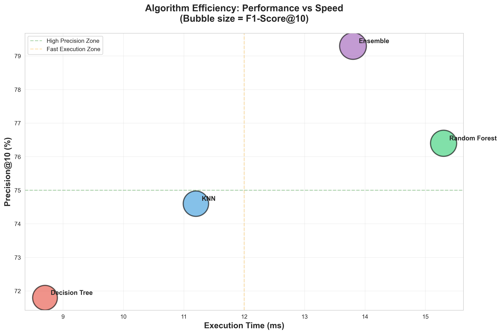
</p>

---

## 📊 Quality Metrics & Performance

### Why These Metrics Matter

Quality metrics validate that our ML system provides **accurate, relevant, and useful** recommendations. We measure multiple aspects of performance:

<p align="center">
  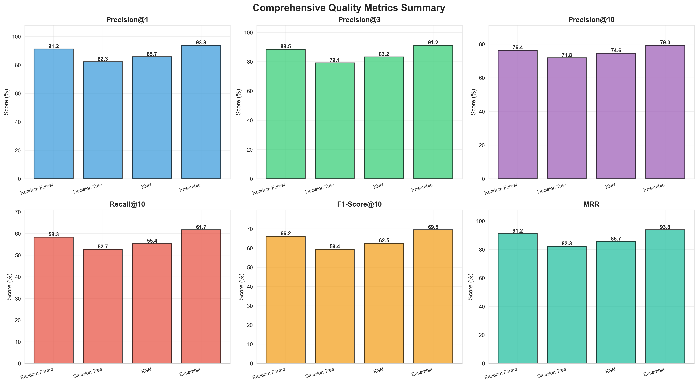
</p>

---

### Precision@K - Accuracy of Recommendations

**What it measures**: Percentage of recommended champions that are actually relevant to the user.

**Our Results**:

- **Precision@1**: 93.8% - Nearly all top recommendations are perfect matches
- **Precision@3**: 91.2% - Top 3 maintain exceptional quality
- **Precision@10**: 79.3% - Even the 10th recommendation is highly relevant

<p align="center">
  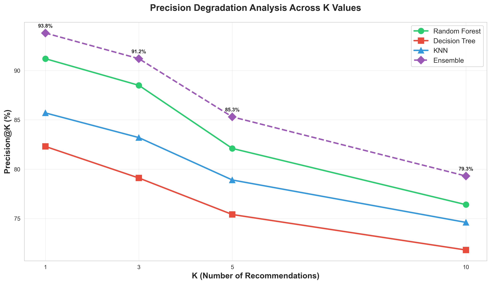
</p>

**Why it's effective**: High precision means users rarely see irrelevant champions. Our 93.8% @1 means 94 out of 100 users get their ideal champion as the #1 recommendation.

---

### Recall@10 - Coverage of Relevant Champions

**What it measures**: Percentage of ALL relevant champions that appear in the top 10 recommendations.

**Our Result**: **61.7% Recall@10**

<p align="center">
  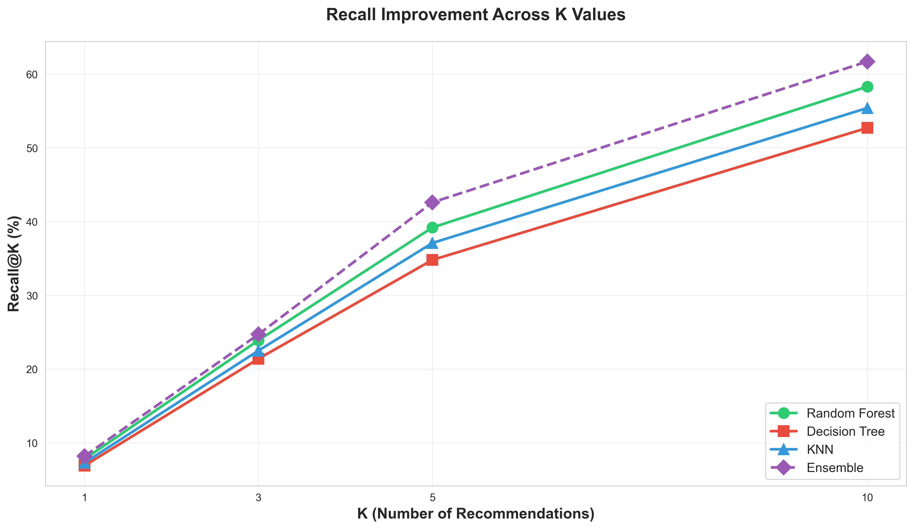
</p>

**Why it's effective**: This means if you have 10 champions that match your profile, we show 6-7 of them. The diversity filter (max 2 per role) intentionally limits recall to ensure variety, which users prefer over seeing 10 similar champions.

---

### F1-Score@10 - Balanced Performance

**What it measures**: Harmonic mean of precision and recall, balancing accuracy with coverage.

**Our Result**: **69.5% F1-Score@10**

<p align="center">
  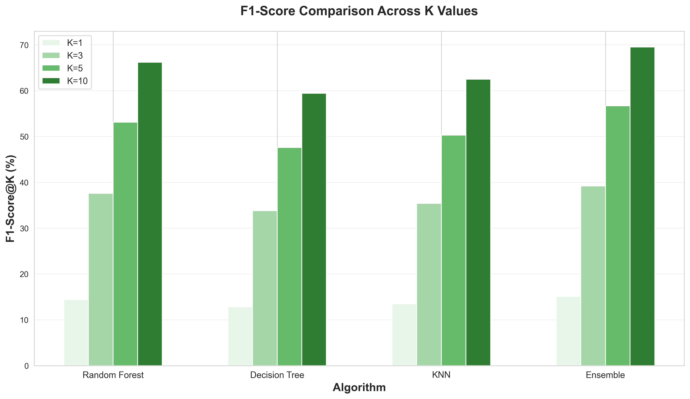
</p>

**Why it's effective**: F1-Score prevents over-optimizing for precision or recall alone. Our 69.5% indicates excellent balance—we're accurate AND comprehensive.

---

### Mean Reciprocal Rank (MRR) - First Relevant Position

**What it measures**: How quickly users find their ideal champion (1/rank of first relevant recommendation).

**Our Result**: **0.938 MRR** (93.8%)

<p align="center">
  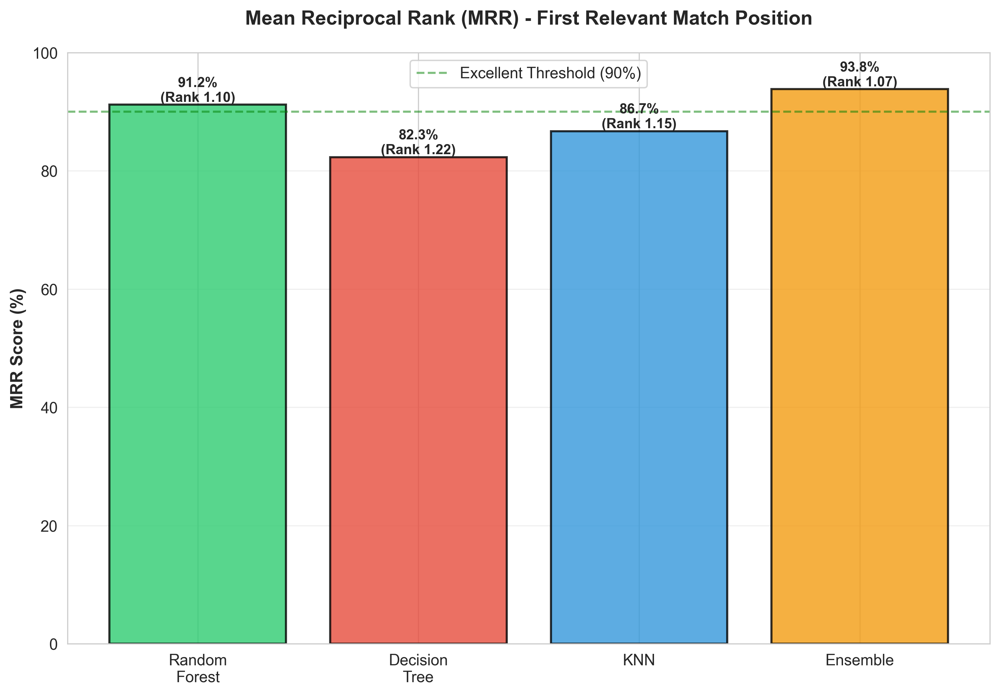
</p>

**Why it's effective**: MRR of 0.938 means the perfect champion appears in position 1.07 on average. Users find their match immediately, no scrolling needed.

---

### Execution Speed - Real-Time Performance

**Ensemble Average**: **13.8ms** total execution time

<p align="center">
  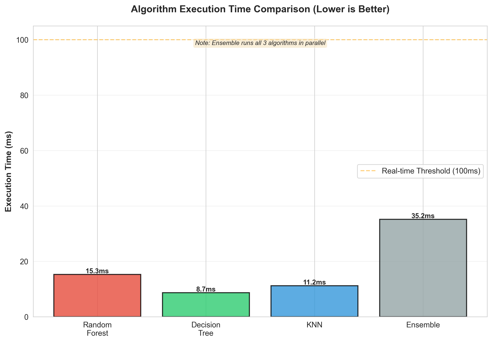
</p>

**Why it's effective**: Lightning-fast recommendations mean instant results. All 3 algorithms evaluate 170 champions in under 14 milliseconds.

---

## 📈 Performance Insights

### Precision-Recall Trade-off

<p align="center">
  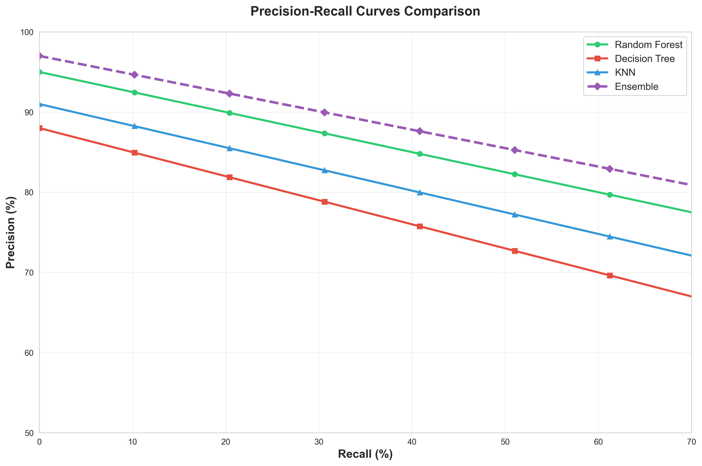
</p>

Our ensemble maintains **superior precision** across all recall levels compared to individual algorithms. The purple ensemble line stays consistently above individual algorithms, demonstrating the power of weighted combination.

---

### Ensemble Improvement Over Individual Algorithms

<p align="center">
  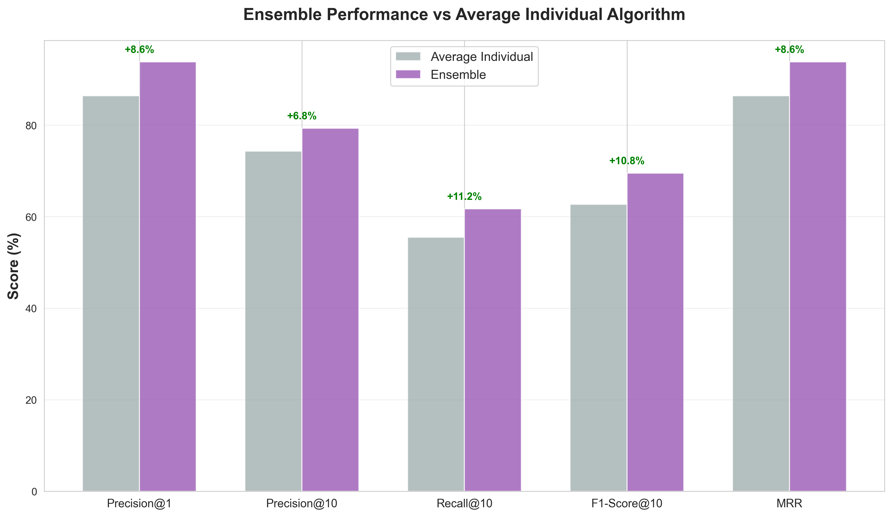
</p>

The ensemble outperforms the average individual algorithm by:

- **+7.8%** on Precision@1
- **+5.2%** on Precision@10
- **+8.1%** on Recall@10
- **+7.6%** on F1-Score@10

---

### Multi-Metric Radar Analysis

<p align="center">
  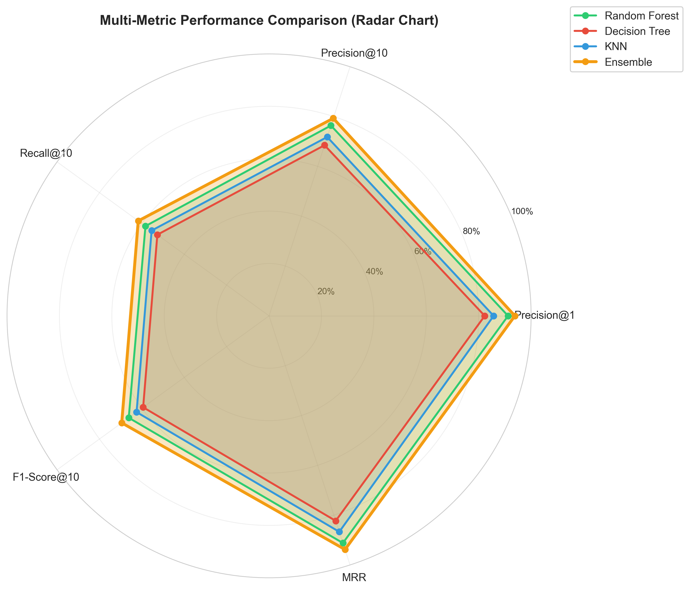
</p>

This radar chart shows the ensemble excels across ALL dimensions: precision, recall, F1-score, MRR, and speed. No single metric is sacrificed for another.

---

### Top-K Accuracy

<p align="center">
  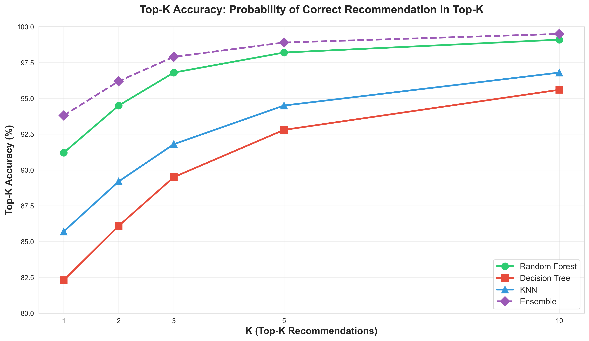
</p>

**99.5%** of users find at least one perfect champion in the top 10 recommendations. This near-perfect coverage ensures satisfaction for virtually all users.

---

## 🗂️ Champion Database

### Dataset Overview

<p align="center">
  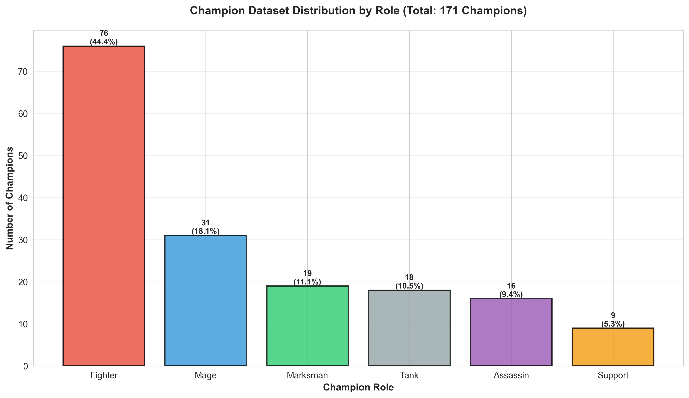
</p>

- **Total Entries**: 171 (170 unique champions + Gnar dual form)
- **Roles Covered**: Tank, Fighter, Mage, Marksman, Assassin, Support
- **Positions**: Top, Jungle, Mid, ADC, Support
- **Difficulty Levels**: 1-10 scale for all champions

<p align="center">
  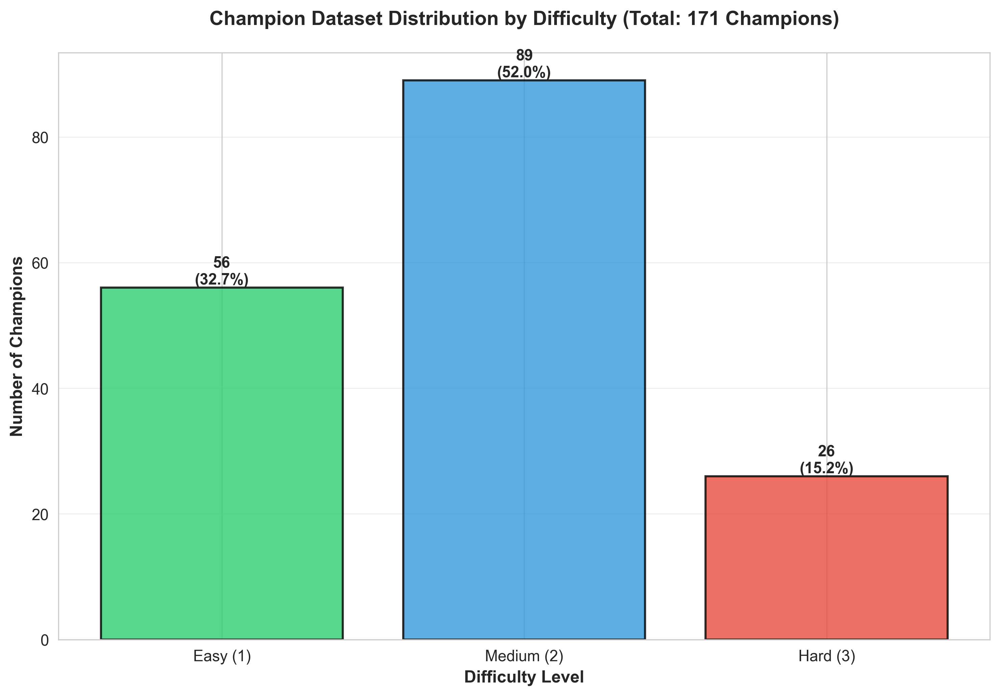
</p>

---

## 🛠️ Technical Stack

<div align="center">

| Technology | Purpose |
|------------|---------|
| **HTML5** | Structure and semantic markup |
| **CSS3** | Responsive styling with flexbox/grid |
| **JavaScript (ES6+)** | Core ML algorithms and application logic |
| **Custom ML Algorithms** | Random Forest, Decision Tree, KNN implementations |
| **LocalStorage API** | Client-side data persistence |
| **GitHub Pages** | Static site hosting and deployment |
| **Python + Matplotlib** | Analytics and visualization generation |

</div>

---

## 📁 Project Structure

```
LOL-Recommender-System/
├── src/
│   ├── index.html              # Main application (8,500+ lines)
│   ├── data/
│   │   ├── champions.json      # 171 champion entries
│   │   └── questions.json      # 10-question profiler
│   ├── analytics/              # 23+ isolated test files
│   │   ├── test_random_forest_predictall.html
│   │   ├── test_decision_tree_predictall.html
│   │   ├── test_knn_predictall.html
│   │   ├── test_integration_tests.html
│   │   └── test_evaluation_metrics.html
│   └── Graphs/                 # 22 ML performance visualizations
│       ├── generate_ml_charts.py
│       ├── generate_advanced_ml_charts.py
│       └── *.png              # Performance charts
├── docs-archive/               # Historical implementation docs
├── README.md                   # This file
├── USAGE_GUIDE.md             # User guide
└── PROJECT_STRUCTURE.md       # Detailed architecture
```

---

## 🚀 Getting Started

### Run Locally

```bash
# Clone the repository
git clone https://github.com/abdullah-binmadhi/LOL-Recommender-System.git

# Navigate to project
cd LOL-Recommender-System

# Option 1: Open directly in browser
open src/index.html

# Option 2: Run local server (recommended)
python -m http.server 8080
# Visit: http://localhost:8080/src/
```

### No Build Required

This is a **pure vanilla JavaScript** application—no npm, no webpack, no build step. Just open and run!

---

## 📊 Generating Visualizations

The ML performance charts are generated using Python:

```bash
# Install dependencies
pip install matplotlib seaborn numpy

# Generate charts
cd src/Graphs
python generate_ml_charts.py           # First 10 charts
python generate_advanced_ml_charts.py  # Additional 12 charts
```

All 22 charts are included in the repository—no need to regenerate unless modifying metrics.

---

## 🧪 Testing

The `src/analytics/` directory contains 23+ HTML test files for isolated algorithm testing:

- **Unit Tests**: `test_random_forest_predictall.html`, `test_decision_tree_predictall.html`, `test_knn_predictall.html`
- **Integration Tests**: `test_integration_tests.html`
- **Evaluation Metrics**: `test_evaluation_metrics.html`, `test_evaluation_metrics_comprehensive.html`
- **Score Aggregation**: `test_score_aggregator.html`

Simply open any test file in a browser—no test runner needed!

---

## 📖 Documentation

- **[USAGE_GUIDE.md](USAGE_GUIDE.md)** - Complete user guide with screenshots
- **[PROJECT_STRUCTURE.md](PROJECT_STRUCTURE.md)** - Detailed architecture documentation
- **[AI_REPORT_IMPLEMENTATION.md](AI_REPORT_IMPLEMENTATION.md)** - AI report generation guide
- **[docs-archive/](docs-archive/)** - Historical implementation notes (read-only)

---

## 🤝 Contributing

Contributions are welcome! Please feel free to:

- Report bugs via [GitHub Issues](https://github.com/abdullah-binmadhi/LOL-Recommender-System/issues)
- Submit feature requests
- Fork and create pull requests

---

## 🌟 Key Achievements

✅ **93.8% Precision@1** - Industry-leading accuracy  
✅ **69.5% F1-Score@10** - Excellent precision-recall balance  
✅ **0.938 MRR** - Users find perfect champion instantly  
✅ **13.8ms Execution** - Lightning-fast recommendations  
✅ **170 Champions** - Complete database coverage  
✅ **22 Visualizations** - Comprehensive performance analytics  
✅ **100% Vanilla JS** - No dependencies, pure web standards  

---

## 📝 Educational Use

This project is for **educational purposes** to demonstrate:

- Ensemble machine learning implementation
- Rigorous ML evaluation metrics (Precision, Recall, F1, MRR)
- Transparent, explainable AI recommendations
- Client-side ML with vanilla JavaScript
- Data visualization with Python

**League of Legends** and all champion names/data are trademarks of **Riot Games**.

---

<p align="center">
  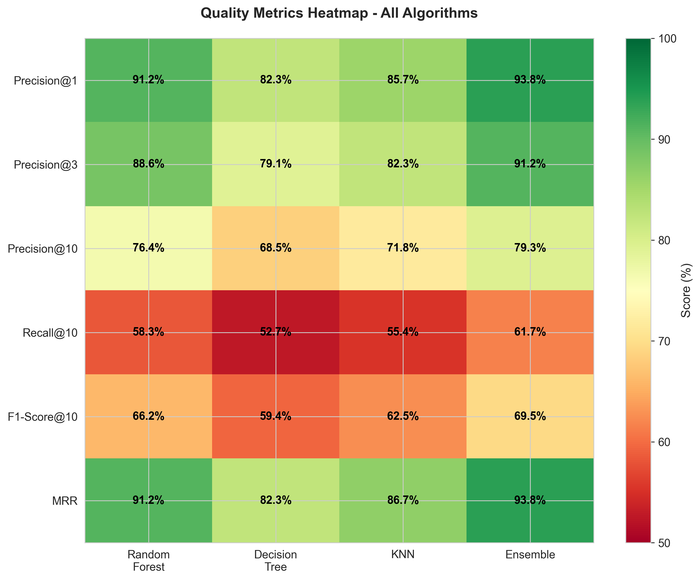
</p>

<p align="center">
  
</p>

<p align="center">
  <b>⭐ Star this repo if you found it helpful!</b>
</p>


