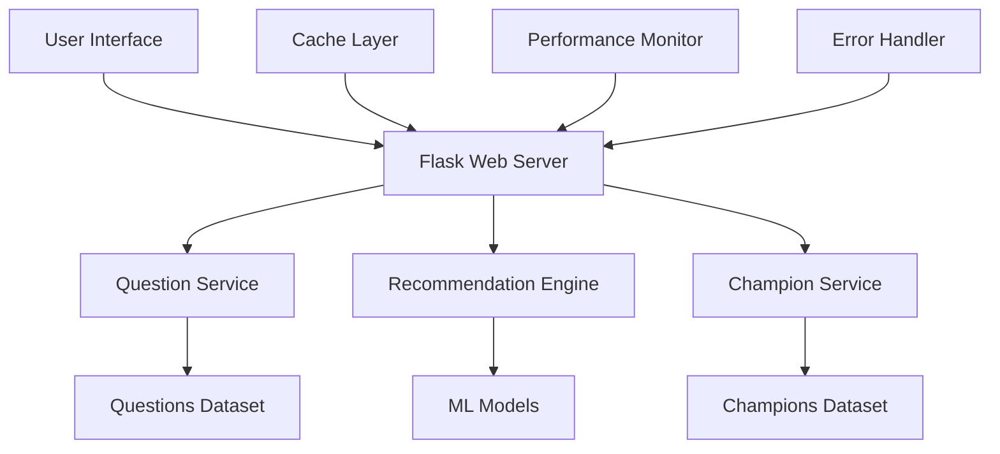

# LoL Champion Recommender - Documentation

## Overview

This directory contains comprehensive documentation for the LoL Champion Recommender application. The documentation is organized to help users, developers, and administrators understand, deploy, and maintain the system.

## Documentation Structure

### User Documentation

- **[User Guide](user_guide.md)** - Complete guide for end users
  - Getting started with the application
  - Using the questionnaire system
  - Understanding recommendations
  - Tips and best practices
  - FAQ and troubleshooting

### Developer Documentation

- **[API Documentation](api_documentation.md)** - Complete API reference
  - Web API endpoints
  - Internal service APIs
  - Data models and schemas
  - Error handling and codes
  - Performance monitoring

- **[Setup Guide](setup_guide.md)** - Development environment setup
  - Prerequisites and installation
  - Configuration options
  - Development tools and workflows
  - Testing procedures

### Operations Documentation

- **[Deployment Guide](deployment_guide.md)** - Production deployment
  - Local development deployment
  - Docker containerization
  - Cloud platform deployment
  - Production server setup
  - Monitoring and maintenance
  - Scaling strategies
  - Security considerations

- **[Troubleshooting Guide](troubleshooting_guide.md)** - Problem resolution
  - Quick diagnostics
  - Common issues and solutions
  - Performance troubleshooting
  - Emergency procedures
  - Monitoring and alerts

## Quick Start

### For Users
1. Read the [User Guide](user_guide.md) to understand how to use the application
2. Visit the application website and start the questionnaire
3. Follow the guided process to get your champion recommendation

### For Developers
1. Follow the [Setup Guide](setup_guide.md) to set up your development environment
2. Review the [API Documentation](api_documentation.md) to understand the system architecture
3. Run the test suite to ensure everything is working correctly

### For System Administrators
1. Review the [Deployment Guide](deployment_guide.md) for production setup
2. Set up monitoring using the [Troubleshooting Guide](troubleshooting_guide.md)
3. Configure alerts and backup procedures

## Key Features Documented

### Application Features
- **Intelligent Questionnaire System**: 9-question assessment covering playstyle preferences
- **Machine Learning Recommendations**: Multiple ML models for accurate champion matching
- **Alternative Recommendations**: Explore multiple champion options
- **Detailed Champion Information**: Comprehensive champion details and abilities
- **Session Management**: Progress saving and questionnaire retaking
- **Responsive Design**: Mobile and desktop compatibility
- **Accessibility Support**: WCAG-compliant interface

### Technical Features
- **RESTful API**: JSON-based API for programmatic access
- **Caching System**: Multi-layer caching for performance
- **Error Handling**: Comprehensive error management and user feedback
- **Performance Monitoring**: Built-in performance tracking and optimization
- **Security**: Input validation, CSRF protection, and secure headers
- **Testing**: Comprehensive test suite with fixtures and mocks

## Architecture Overview

## Technology Stack

### Backend
- **Python 3.8+**: Core application language
- **Flask**: Web framework
- **scikit-learn**: Machine learning library
- **pandas**: Data manipulation
- **NumPy**: Numerical computing

### Frontend
- **HTML5/CSS3**: Modern web standards
- **JavaScript**: Interactive functionality
- **Bootstrap**: Responsive design framework

### Infrastructure
- **Gunicorn**: WSGI HTTP Server
- **Nginx**: Reverse proxy and static file serving
- **Redis**: Caching and session storage
- **Docker**: Containerization

### Development Tools
- **pytest**: Testing framework
- **black**: Code formatting
- **flake8**: Code linting
- **coverage**: Test coverage analysis

## Data Sources

### Champion Data
- **Source**: League of Legends official data
- **Format**: JSON with champion attributes, abilities, and metadata
- **Updates**: Regular updates to reflect game changes

### Question Data
- **Source**: Curated questionnaire based on gameplay research
- **Format**: JSON with question types, options, and weights
- **Validation**: Comprehensive answer validation rules

### ML Training Data
- **Source**: Generated from champion attributes and user preferences
- **Models**: Random Forest, K-Nearest Neighbors, ensemble methods
- **Accuracy**: Regularly evaluated and retrained

## Performance Characteristics

### Response Times
- **Page Load**: < 2 seconds
- **API Responses**: < 500ms
- **ML Predictions**: < 300ms
- **Cache Hit Rate**: > 80%

### Scalability
- **Concurrent Users**: Tested up to 100 concurrent users
- **Horizontal Scaling**: Load balancer ready
- **Vertical Scaling**: Configurable worker processes
- **Caching**: Multi-layer caching strategy

### Reliability
- **Uptime Target**: 99.9%
- **Error Rate**: < 1%
- **Recovery Time**: < 5 minutes
- **Backup Strategy**: Automated daily backups

## Security Features

### Application Security
- **Input Validation**: All user inputs validated
- **CSRF Protection**: Cross-site request forgery prevention
- **XSS Prevention**: Output encoding and CSP headers
- **Session Security**: Secure session management

### Infrastructure Security
- **HTTPS**: SSL/TLS encryption
- **Firewall**: UFW firewall configuration
- **Updates**: Automated security updates
- **Monitoring**: Security event logging

## Compliance and Standards

### Web Standards
- **HTML5**: Semantic markup
- **CSS3**: Modern styling
- **WCAG 2.1**: Accessibility compliance
- **Responsive Design**: Mobile-first approach

### Code Quality
- **PEP 8**: Python style guide compliance
- **Type Hints**: Static type checking
- **Documentation**: Comprehensive docstrings
- **Testing**: >90% code coverage

## Support and Community

### Getting Help
- **Documentation**: Comprehensive guides and references
- **GitHub Issues**: Bug reports and feature requests
- **Email Support**: Direct support contact
- **Community**: User forums and discussions

### Contributing
- **Code Contributions**: Pull requests welcome
- **Documentation**: Help improve documentation
- **Testing**: Add test cases and scenarios
- **Feedback**: User experience feedback

## Version History

### Version 1.0.0 (Current)
- Initial release with core functionality
- Complete questionnaire system
- ML-based recommendations
- Comprehensive documentation
- Full test suite

### Planned Features
- **User Accounts**: Optional user registration
- **Recommendation History**: Track past recommendations
- **Advanced Filtering**: More detailed champion filtering
- **API Expansion**: Extended API capabilities
- **Mobile App**: Native mobile applications

## License and Legal

### Software License
- **License**: MIT License
- **Open Source**: Freely available and modifiable
- **Attribution**: Credit required for derivatives

### Data Usage
- **Champion Data**: Used under fair use for educational purposes
- **User Data**: No personal data collected or stored
- **Privacy**: Privacy-first design approach

---

## Document Maintenance

This documentation is maintained alongside the codebase and updated with each release. For the most current information, always refer to the latest version in the repository.

**Last Updated**: January 2024  
**Version**: 1.0.0  
**Maintainers**: Development Team

---

*For questions about this documentation, please contact the development team or create an issue in the project repository.*